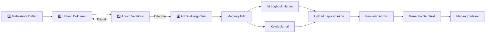

# Use Case dan Desain Database - Sistem Manajemen Magang BRIDA Surabaya

> **Tech Stack**: Node.js (Backend), PostgreSQL (Database), Supabase (Storage)
> **Roles**: Mahasiswa dan Admin

---

## 1. Use Case Diagram

```mermaid
flowchart TB
    subgraph Actors
        MHSW["🎓 Mahasiswa"]
        ADMIN["👔 Admin"]
    end

    subgraph Auth["🔐 Autentikasi"]
        UC1["Registrasi Akun"]
        UC2["Login"]
        UC3["Logout"]
    end

    subgraph StudentFeatures["📚 Fitur Mahasiswa"]
        UC4["Kelola Profil"]
        UC5["Upload Dokumen Persyaratan"]
        UC6["Kelola Logbook Harian"]
        UC7["Kelola Jurnal"]
        UC8["Upload Laporan Akhir"]
        UC9["Lihat Hasil Penilaian"]
        UC10["Download Sertifikat"]
        UC11["Lihat Tusi BRIDA"]
    end

    subgraph AdminFeatures["⚙️ Fitur Admin"]
        UC12["Dashboard Statistik"]
        UC13["Verifikasi Dokumen & Pendaftaran"]
        UC14["Kelola Data Mahasiswa"]
        UC15["Assign Tusi BRIDA"]
        UC16["Lihat Logbook Mahasiswa"]
        UC17["Berikan Penilaian"]
        UC18["Validasi Jurnal"]
        UC19["Generate Sertifikat"]
        UC20["Kelola Data Tusi BRIDA"]
    end

    MHSW --> UC1 & UC2 & UC3
    MHSW --> UC4 & UC5 & UC6 & UC7 & UC8 & UC9 & UC10 & UC11

    ADMIN --> UC2 & UC3
    ADMIN --> UC12 & UC13 & UC14 & UC15 & UC16 & UC17 & UC18 & UC19 & UC20
```

---

## 2. Alur Bisnis (Business Flow)

**Status Flow User**: `pending` → `documents_uploaded` → `verified` → `active` → `completed`

---

## 3. Entity Relationship Diagram

```mermaid
erDiagram
    users ||--o| mahasiswa : has_profile
    mahasiswa ||--o{ dokumen : uploads
    mahasiswa ||--o{ logbook : writes
    mahasiswa ||--o{ jurnal : creates
    mahasiswa ||--o{ presensi : records
    mahasiswa ||--o{ penilaian : receives
    mahasiswa ||--o{ sertifikat : earns
    mahasiswa ||--o{ laporan_akhir : submits
    mahasiswa ||--o| administrasi : fills
    mahasiswa ||--o{ mahasiswa_mata_kuliah : selects
    mahasiswa }o--|| tusi_brida : assigned_to
    jenis_aktivitas ||--o{ logbook : categorizes
    mata_kuliah_konversi ||--o{ mahasiswa_mata_kuliah : has
    mata_kuliah_konversi ||--o{ logbook : referenced_in
    penilaian ||--o{ nilai_penilaian : contains
    kriteria_penilaian ||--o{ nilai_penilaian : defines
    mahasiswa ||--o| nilai_akhir : has_final_score
    mahasiswa ||--o{ kurikulum_magang : fills
    mahasiswa ||--o| surat_keterangan : issued
    
    users {
        uuid id PK
        varchar email UK
        varchar password_hash
        enum role
        timestamp created_at
        timestamp updated_at
    }
    
    mahasiswa {
        uuid id PK
        uuid user_id FK
        varchar full_name
        varchar phone
        text address
        varchar university
        varchar major
        varchar nim
        int semester
        enum internship_type
        varchar internship_duration
        varchar conversion_type
        varchar profile_image_url
        enum status
        uuid tusi_brida_id FK
        uuid assigned_by FK
        timestamp tusi_assigned_at
        timestamp created_at
        timestamp updated_at
    }
    
    tusi_brida {
        uuid id PK
        varchar name UK
        varchar slug UK
        text short_description
        text full_description
        varchar icon
        varchar image_url
        text responsibilities
        text requirements
        boolean is_active
        int display_order
        timestamp created_at
        timestamp updated_at
    }
    
    dokumen {
        uuid id PK
        uuid mahasiswa_id FK
        enum document_type
        varchar file_name
        varchar file_url
        int file_size
        enum status
        varchar rejection_reason
        uuid verified_by FK
        timestamp verified_at
        timestamp created_at
        timestamp updated_at
    }
    
    jenis_aktivitas {
        uuid id PK
        varchar name UK
        text description
        boolean is_active
        int display_order
        timestamp created_at
    }
    
    logbook {
        uuid id PK
        uuid mahasiswa_id FK
        uuid jenis_aktivitas_id FK
        uuid mata_kuliah_id FK
        date log_date
        time start_time
        time end_time
        varchar total_jam_kerja
        text description
        varchar lokasi
        varchar attachment_url
        varchar university
        varchar major
        enum status
        uuid reviewed_by FK
        timestamp reviewed_at
        timestamp deleted_at
        timestamp created_at
        timestamp updated_at
    }
    
    mata_kuliah_konversi {
        uuid id PK
        varchar name UK
        text description
        boolean is_active
        int display_order
        timestamp created_at
    }
    
    mahasiswa_mata_kuliah {
        uuid id PK
        uuid mahasiswa_id FK
        uuid mata_kuliah_id FK
        timestamp created_at
    }
    
    administrasi {
        uuid id PK
        uuid mahasiswa_id FK
        boolean needs_reply_letter
        text proposal_description
        text topic
        text expected_results
        boolean has_course_conversion
        boolean declaration
        enum status
        timestamp created_at
        timestamp updated_at
    }
    
    jurnal {
        uuid id PK
        uuid mahasiswa_id FK
        varchar title
        text content
        varchar file_name
        varchar file_url
        int file_size
        enum status
        uuid reviewed_by FK
        timestamp reviewed_at
        timestamp created_at
        timestamp updated_at
    }
    
    kriteria_penilaian {
        uuid id PK
        varchar name UK
        enum category
        int bobot
        text description
        boolean is_active
        int display_order
        timestamp created_at
    }
    
    penilaian {
        uuid id PK
        uuid mahasiswa_id FK
        uuid assessed_by FK
        enum assessor_type
        enum component
        uuid peer_mahasiswa_id FK
        decimal final_score
        text feedback
        timestamp created_at
        timestamp updated_at
    }
    
    nilai_akhir {
        uuid id PK
        uuid mahasiswa_id FK
        decimal nilai_perilaku
        decimal nilai_perilaku_final
        decimal nilai_kinerja
        decimal nilai_kinerja_final
        decimal nilai_akhir
        varchar grade
        timestamp created_at
        timestamp updated_at
    }
    
    nilai_penilaian {
        uuid id PK
        uuid penilaian_id FK
        uuid kriteria_id FK
        int score
        text keterangan
        timestamp created_at
    }
    
    sertifikat {
        uuid id PK
        uuid mahasiswa_id FK
        varchar nomor_sertifikat UK
        varchar file_url
        date tanggal_terbit
        timestamp created_at
    }
    
    laporan_akhir {
        uuid id PK
        uuid mahasiswa_id FK
        varchar file_name
        varchar file_url
        int file_size
        enum status
        timestamp submitted_at
        uuid reviewed_by FK
        timestamp reviewed_at
        timestamp created_at
    }
    
    presensi {
        uuid id PK
        uuid mahasiswa_id FK
        date tanggal
        time jam_masuk
        enum status
        text keterangan
        varchar bukti_url
        enum status_validasi
        uuid validated_by FK
        timestamp validated_at
        timestamp created_at
    }
```

---

## 4. Detail Struktur Tabel

### 4.1 Tabel `users` (Auth)

| Kolom | Tipe | Constraint | Keterangan |
|:------|:-----|:-----------|:-----------|
| id | UUID | PK | ID unik |
| email | VARCHAR(255) | UNIQUE, NOT NULL | Email login |
| password_hash | VARCHAR(255) | NOT NULL | Password (bcrypt) |
| role | ENUM('student','admin') | NOT NULL, DEFAULT 'student' | Role |
| created_at | TIMESTAMP | DEFAULT NOW() | |
| updated_at | TIMESTAMP | | |

---

### 4.2 Tabel `mahasiswa`

| Kolom | Tipe | Constraint | Keterangan |
|:------|:-----|:-----------|:-----------|
| id | UUID | PK | ID unik |
| user_id | UUID | FK → users(id), UNIQUE, NOT NULL | Referensi ke auth |
| full_name | VARCHAR(255) | NOT NULL | Nama lengkap |
| phone | VARCHAR(20) | | Telepon |
| address | TEXT | | Alamat |
| university | VARCHAR(255) | | Universitas |
| major | VARCHAR(255) | | Prodi |
| nim | VARCHAR(50) | | NIM/NPM |
| semester | INTEGER | | Semester |
| internship_type | ENUM('magang_kp','magang_mbkm','magang_mandiri') | | Jenis magang |
| internship_duration | VARCHAR(50) | | Durasi |
| conversion_type | VARCHAR(50) | | Konversi SKS |
| profile_image_url | VARCHAR(500) | | URL foto profil |
| status | ENUM('pending','documents_uploaded','verified','active','completed') | DEFAULT 'pending' | Status |
| tusi_brida_id | UUID | FK → tusi_brida(id) | Tusi BRIDA |
| assigned_by | UUID | FK → users(id) | Admin yang meng-assign tusi (role: Admin) |
| tusi_assigned_at | TIMESTAMP | | Waktu assign |
| created_at | TIMESTAMP | DEFAULT NOW() | |
| updated_at | TIMESTAMP | | |

---

### 4.3 Tabel `tusi_brida`

| Kolom | Tipe | Constraint | Keterangan |
|:------|:-----|:-----------|:-----------|
| id | UUID | PK | ID unik |
| name | VARCHAR(100) | UNIQUE, NOT NULL | Nama tusi |
| slug | VARCHAR(100) | UNIQUE, NOT NULL | URL-friendly name |
| short_description | TEXT | | Deskripsi singkat |
| full_description | TEXT | | Deskripsi lengkap |
| icon | VARCHAR(50) | | Icon material-symbols |
| image_url | VARCHAR(500) | | URL gambar |
| responsibilities | TEXT | | Tugas (JSON) |
| requirements | TEXT | | Persyaratan (JSON) |
| is_active | BOOLEAN | DEFAULT true | Status aktif |
| display_order | INTEGER | | Urutan |
| created_at | TIMESTAMP | DEFAULT NOW() | |
| updated_at | TIMESTAMP | | |

---

### 4.4 Tabel `dokumen`

| Kolom | Tipe | Constraint | Keterangan |
|:------|:-----|:-----------|:-----------|
| id | UUID | PK | ID unik |
| mahasiswa_id | UUID | FK → mahasiswa(id), NOT NULL | Pemilik |
| document_type | ENUM('surat_pengantar','proposal','ktp','ktm','cv','surat_pernyataan') | NOT NULL | Jenis |
| file_name | VARCHAR(255) | NOT NULL | Nama file |
| file_url | VARCHAR(500) | NOT NULL | URL Supabase |
| file_size | INTEGER | | Ukuran (bytes) |
| status | ENUM('pending','approved','rejected') | DEFAULT 'pending' | Status |
| rejection_reason | VARCHAR(500) | | Alasan ditolak |
| verified_by | UUID | FK → users(id) | Admin yang memverifikasi (role: Admin) |
| verified_at | TIMESTAMP | | Waktu verifikasi |
| created_at | TIMESTAMP | DEFAULT NOW() | |
| updated_at | TIMESTAMP | | |

---

### 4.5 Tabel `jenis_aktivitas` (Master)

| Kolom | Tipe | Constraint | Keterangan |
|:------|:-----|:-----------|:-----------|
| id | UUID | PK | ID unik |
| name | VARCHAR(100) | UNIQUE, NOT NULL | Nama aktivitas (Rapat, Administrasi, Entry Data, dll) |
| description | TEXT | | Deskripsi aktivitas |
| is_active | BOOLEAN | DEFAULT true | Status aktif |
| display_order | INTEGER | | Urutan tampilan |
| created_at | TIMESTAMP | DEFAULT NOW() | |

**Contoh data:**
| name |
|:-----|
| Membuat Kajian untuk Polisi Brief |
| Kajian Sistem dan Produk |
| Rapat |
| Administrasi |
| Entry Data |
| Mengelolah Data / Analisis Data |
| Rekapitulasi Data Kajian |
| Membantu Monef Inovasi |
| Membantu Membuat Sistem / AI |
| Memonitoring / Update |
| Pembuatan Konten |

---

### 4.6 Tabel `logbook`

| Kolom | Tipe | Constraint | Keterangan |
|:------|:-----|:-----------|:-----------|
| id | UUID | PK | ID unik |
| mahasiswa_id | UUID | FK → mahasiswa(id), NOT NULL | Pemilik |
| jenis_aktivitas_id | UUID | FK → jenis_aktivitas(id) | Jenis aktivitas |
| mata_kuliah_id | UUID | FK → mata_kuliah_konversi(id) | Mata kuliah konversi terkait |
| log_date | DATE | NOT NULL | Tanggal |
| start_time | TIME | | Jam mulai |
| end_time | TIME | | Jam selesai |
| total_jam_kerja | VARCHAR(50) | | Total jam kerja (auto-calculated) |
| description | TEXT | NOT NULL | Uraian kegiatan |
| lokasi | VARCHAR(255) | | Lokasi kegiatan |
| attachment_url | VARCHAR(500) | | URL lampiran |
| university | VARCHAR(255) | | Universitas |
| major | VARCHAR(255) | | Prodi |
| status | ENUM('draft','submitted','reviewed','approved','rejected') | DEFAULT 'draft' | Status |
| reviewed_by | UUID | FK → users(id) | Admin yang me-review (role: Admin) |
| reviewed_at | TIMESTAMP | | Waktu review |
| deleted_at | TIMESTAMP | | Waktu dihapus (soft delete) |
| created_at | TIMESTAMP | DEFAULT NOW() | |
| updated_at | TIMESTAMP | | |

---

### 4.7 Tabel `jurnal`

| Kolom | Tipe | Constraint | Keterangan |
|:------|:-----|:-----------|:-----------|
| id | UUID | PK | ID unik |
| mahasiswa_id | UUID | FK → mahasiswa(id), NOT NULL | Pemilik |
| title | VARCHAR(255) | NOT NULL | Judul jurnal |
| content | TEXT | | Isi/ringkasan |
| file_name | VARCHAR(255) | | Nama file |
| file_url | VARCHAR(500) | | URL Supabase |
| file_size | INTEGER | | Ukuran (bytes) |
| status | ENUM('draft','submitted','reviewed','approved','rejected') | DEFAULT 'draft' | Status |
| reviewed_by | UUID | FK → users(id) | Admin yang me-review (role: Admin) |
| reviewed_at | TIMESTAMP | | Waktu review |
| created_at | TIMESTAMP | DEFAULT NOW() | |
| updated_at | TIMESTAMP | | |

---

### 4.8 Tabel `kriteria_penilaian` (Master)

| Kolom | Tipe | Constraint | Keterangan |
|:------|:-----|:-----------|:-----------|
| id | UUID | PK | ID unik |
| name | VARCHAR(100) | UNIQUE, NOT NULL | Nama kriteria |
| category | ENUM('behavior','performance') | NOT NULL | Kategori penilaian |
| bobot | INTEGER | NOT NULL | Bobot penilaian dalam persen (%) |
| description | TEXT | | Deskripsi kriteria |
| is_active | BOOLEAN | DEFAULT true | Status aktif |
| display_order | INTEGER | | Urutan tampilan |
| created_at | TIMESTAMP | DEFAULT NOW() | |

**Contoh data:**
| name | category | bobot |
|:-----|:---------|:------|
| Kedisiplinan (Discipline) | behavior | 10 |
| Tanggung Jawab (Responsibility) | behavior | 10 |
| Kerja Sama (Teamwork) | behavior | 10 |
| Sikap & Etika (Attitude) | behavior | 10 |
| Kualitas Hasil Kerja (Quality of Work) | performance | 20 |
| Ketepatan Waktu (Timeliness) | performance | 10 |
| Kemampuan Teknis (Technical Skill) | performance | 15 |
| Pemahaman Tugas (Task Understanding) | performance | 15 |

---

### 4.9 Tabel `penilaian` (Header — Updated)

| Kolom | Tipe | Constraint | Keterangan |
|:------|:-----|:-----------|:-----------|
| id | UUID | PK | ID unik |
| mahasiswa_id | UUID | FK → mahasiswa(id), NOT NULL | Mahasiswa yang dinilai |
| assessed_by | UUID | FK → users(id), NOT NULL | User yang menilai |
| assessor_type | ENUM('self','peer','koordinator','sekretaris','admin') | NOT NULL | Tipe penilai |
| component | ENUM('perilaku','kinerja') | NOT NULL | Komponen penilaian |
| peer_mahasiswa_id | UUID | FK → mahasiswa(id), NULLABLE | Jika peer, siapa penilainya |
| final_score | DECIMAL(5,2) | | Rata-rata skor komponen ini |
| feedback | TEXT | | Komentar umum |
| created_at | TIMESTAMP | DEFAULT NOW() | |
| updated_at | TIMESTAMP | | |

> **UNIQUE**(mahasiswa_id, assessed_by, assessor_type, component) — 1 penilai hanya bisa menilai 1x per komponen per mahasiswa.

---

### 4.9b Tabel `nilai_akhir` (BARU)

| Kolom | Tipe | Constraint | Keterangan |
|:------|:-----|:-----------|:-----------|
| id | UUID | PK | ID unik |
| mahasiswa_id | UUID | FK → mahasiswa(id), UNIQUE | 1 record per mahasiswa |
| nilai_perilaku | DECIMAL(5,2) | | Rata-rata perilaku (0-100) |
| nilai_perilaku_final | DECIMAL(5,2) | | nilai_perilaku × 0.4 |
| nilai_kinerja | DECIMAL(5,2) | | Rata-rata kinerja (0-100) |
| nilai_kinerja_final | DECIMAL(5,2) | | nilai_kinerja × 0.6 |
| nilai_akhir | DECIMAL(5,2) | | NP + NK = Nilai Final |
| grade | VARCHAR(2) | | A/B/C/D |
| created_at | TIMESTAMP | DEFAULT NOW() | |
| updated_at | TIMESTAMP | | |

> **Skala Nilai**: A (86-100 Sangat Baik), B (71-85 Baik), C (51-70 Cukup Baik), D (<50 Perlu Perbaikan)

---

### 4.10 Tabel `nilai_penilaian` (Detail)

| Kolom | Tipe | Constraint | Keterangan |
|:------|:-----|:-----------|:-----------|
| id | UUID | PK | ID unik |
| penilaian_id | UUID | FK → penilaian(id), NOT NULL | Referensi penilaian |
| kriteria_id | UUID | FK → kriteria_penilaian(id), NOT NULL | Referensi kriteria |
| score | INTEGER | CHECK (1-100), NOT NULL | Nilai |
| keterangan | TEXT | | Catatan per kriteria |
| created_at | TIMESTAMP | DEFAULT NOW() | |

---

### 4.11 Tabel `sertifikat`

| Kolom | Tipe | Constraint | Keterangan |
|:------|:-----|:-----------|:-----------|
| id | UUID | PK | ID unik |
| mahasiswa_id | UUID | FK → mahasiswa(id), NOT NULL | Pemilik |
| nomor_sertifikat | VARCHAR(100) | UNIQUE, NOT NULL | Nomor sertifikat |
| file_url | VARCHAR(500) | NOT NULL | URL Supabase |
| tanggal_terbit | DATE | NOT NULL | Tanggal terbit |
| created_at | TIMESTAMP | DEFAULT NOW() | |

---

### 4.12 Tabel `laporan_akhir`

| Kolom | Tipe | Constraint | Keterangan |
|:------|:-----|:-----------|:-----------|
| id | UUID | PK | ID unik |
| mahasiswa_id | UUID | FK → mahasiswa(id), NOT NULL | Pemilik |
| file_name | VARCHAR(255) | NOT NULL | Nama file |
| file_url | VARCHAR(500) | NOT NULL | URL Supabase |
| file_size | INTEGER | | Ukuran (bytes) |
| status | ENUM('pending','approved','rejected') | DEFAULT 'pending' | Status |
| submitted_at | TIMESTAMP | DEFAULT NOW() | Waktu submit |
| reviewed_by | UUID | FK → users(id) | Admin yang me-review (role: Admin) |
| reviewed_at | TIMESTAMP | | Waktu review |
| created_at | TIMESTAMP | DEFAULT NOW() | |

---

### 4.13 Tabel `presensi`

| Kolom | Tipe | Constraint | Keterangan |
|:------|:-----|:-----------|:-----------|
| id | UUID | PK | ID unik |
| mahasiswa_id | UUID | FK → mahasiswa(id), NOT NULL | Pemilik |
| tanggal | DATE | NOT NULL | Tanggal presensi |
| jam_masuk | TIME | | Jam check-in (null jika izin/sakit) |
| status | ENUM('hadir','izin','sakit') | NOT NULL | Status kehadiran |
| keterangan | TEXT | | Tepat Waktu / Terlambat / alasan izin |
| bukti_url | VARCHAR(500) | | Link bukti (untuk izin/sakit) |
| status_validasi | ENUM('pending','approved','rejected') | DEFAULT 'pending' | Status validasi izin |
| validated_by | UUID | FK → users(id) | Admin yang memvalidasi (role: Admin) |
| validated_at | TIMESTAMP | | Waktu validasi |
| created_at | TIMESTAMP | DEFAULT NOW() | |

---

### 4.14 Tabel `mata_kuliah_konversi` (Master)

| Kolom | Tipe | Constraint | Keterangan |
|:------|:-----|:-----------|:-----------|
| id | UUID | PK | ID unik |
| name | VARCHAR(255) | UNIQUE, NOT NULL | Nama mata kuliah |
| description | TEXT | | Deskripsi |
| is_active | BOOLEAN | DEFAULT true | Status aktif |
| display_order | INTEGER | | Urutan tampilan |
| created_at | TIMESTAMP | DEFAULT NOW() | |

**Contoh data:**
| name |
|:-----|
| Kerja Praktik |
| Proyek Akhir |
| Magang Industri |
| Studi Independen |

---

### 4.15 Tabel `mahasiswa_mata_kuliah` (Junction)

| Kolom | Tipe | Constraint | Keterangan |
|:------|:-----|:-----------|:-----------|
| id | UUID | PK | ID unik |
| mahasiswa_id | UUID | FK → mahasiswa(id), NOT NULL | Mahasiswa |
| mata_kuliah_id | UUID | FK → mata_kuliah_konversi(id), NOT NULL | Mata kuliah |
| created_at | TIMESTAMP | DEFAULT NOW() | |

> Tabel junction many-to-many: 1 mahasiswa bisa memilih beberapa mata kuliah konversi, dan 1 mata kuliah bisa dipilih oleh banyak mahasiswa.

---

### 4.16 Tabel `administrasi`

| Kolom | Tipe | Constraint | Keterangan |
|:------|:-----|:-----------|:-----------|
| id | UUID | PK | ID unik |
| mahasiswa_id | UUID | FK → mahasiswa(id), UNIQUE, NOT NULL | Pemilik (1 mahasiswa = 1 form) |
| needs_reply_letter | BOOLEAN | DEFAULT false | Butuh surat balasan BRIDA? |
| proposal_description | TEXT | NOT NULL | Deskripsi proposal (min. 100 kata) |
| topic | TEXT | | Topik magang |
| expected_results | TEXT | | Hasil yang diharapkan (JSON array) |
| has_course_conversion | BOOLEAN | DEFAULT false | Ada konversi mata kuliah? |
| declaration | BOOLEAN | NOT NULL | Pernyataan (harus true) |
| status | ENUM('draft','submitted','verified') | DEFAULT 'draft' | Status form |
| created_at | TIMESTAMP | DEFAULT NOW() | |
| updated_at | TIMESTAMP | | |

---

### 4.17 Tabel `surat_keterangan`

| Kolom | Tipe | Constraint | Keterangan |
|:------|:-----|:-----------|:-----------|
| id | UUID | PK | ID unik |
| mahasiswa_id | UUID | FK → mahasiswa(id), UNIQUE, NOT NULL | Pemilik (1 mahasiswa = 1 surat) |
| nomor_surat | VARCHAR(100) | UNIQUE, NOT NULL | Nomor surat (auto-generated) |
| perangkat_daerah | VARCHAR(255) | | Perangkat daerah / lokus |
| instansi | VARCHAR(255) | | Nama instansi |
| tanggal_mulai | DATE | NOT NULL | Tanggal mulai magang |
| tanggal_selesai | DATE | NOT NULL | Tanggal selesai magang |
| tanggal_terbit | DATE | NOT NULL | Tanggal terbit surat |
| kepala_name | VARCHAR(255) | | Nama pejabat penandatangan |
| kepala_nip | VARCHAR(50) | | NIP pejabat |
| jabatan_kepala | VARCHAR(255) | | Jabatan penandatangan |
| bidang | VARCHAR(255) | | Bidang / Tim Lokus |
| fokus_kegiatan | TEXT | | Kurikulum magang (JSON array) |
| file_url | VARCHAR(500) | | URL file PDF |
| created_at | TIMESTAMP | DEFAULT NOW() | |

---

### 4.18 Tabel `kurikulum_magang`

| Kolom | Tipe | Constraint | Keterangan |
|:------|:-----|:-----------|:-----------|
| id | UUID | PK | ID unik |
| mahasiswa_id | UUID | FK → mahasiswa(id), NOT NULL | Mahasiswa pemilik |
| materi | TEXT | NOT NULL | Materi kurikulum yang diperoleh/diterapkan |
| created_at | TIMESTAMPTZ | DEFAULT NOW() | |
| updated_at | TIMESTAMPTZ | DEFAULT NOW() | |

---

## 5. Supabase Storage Buckets

| Bucket | Access | Deskripsi |
|:-------|:-------|:----------|
| `foto-profil` | Public | Foto profil |
| `dokumen` | Private | Dokumen persyaratan |
| `lampiran-logbook` | Private | Lampiran logbook |
| `jurnal` | Private | File jurnal |
| `laporan-akhir` | Private | Laporan akhir |
| `sertifikat` | Private | Sertifikat |
| `surat-keterangan` | Private | Surat keterangan lulus magang |
| `gambar-tusi` | Public | Gambar tusi BRIDA |

---

## 6. Catatan Teknis

- Password di-hash menggunakan **bcrypt**
- UUID menggunakan `uuid_generate_v4()` dari PostgreSQL
- Timestamp menggunakan **timezone 'Asia/Jakarta'**
- File storage menggunakan **Supabase Storage** dengan RLS

